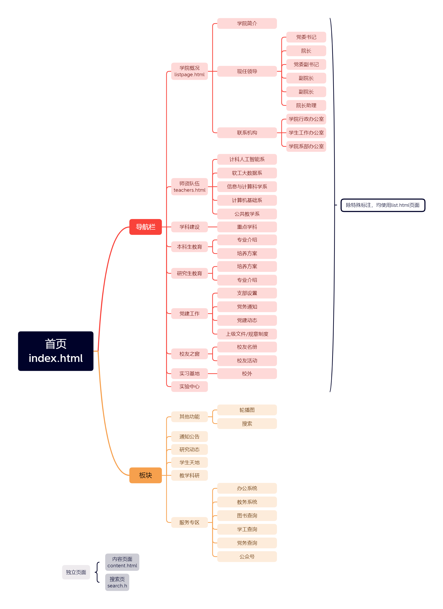

## 首页布局和板块

## 关于git

* `git push`前先执行一次`git pull`
* `git commit`要注释本次改动的内容
* 使用`git add .`后，`git status`检查一下

## 前端规范

### 命名规范

[web前端命名规范整理 - 简书 (jianshu.com)](https://www.jianshu.com/p/6417143c4b18)

没有硬性要求，只要稍微规范点就可以了

### 路径规范(默认根路径`src/`)

* `JavaScript`文件统一放在`JavaScript`文件夹下，例如`jquery.js`放在`JavaScript`文件夹内
* `js`插件统一放在`JavaScript/plugs`文件夹下，例如`banner`图滚动插件
* `css`文件统一放在`css`文件夹内
    * 公共`css样式`放在`global.css`内
    * 非公共`css样式`，即页面单独样式，命名与页面名相同，例如`index.html`的css样式为`index.css`
* 图片统一放在`images`文件夹内
    * 有显著特点的图片放在同一文件夹，例如`banner`图，放在`images/banner/`文件夹内
    * 其余图片直接放入`images`，例如`web_logo.png`放在`images/`中
* 视频统一放在`videos`文件夹内
    * 分类方法如图片